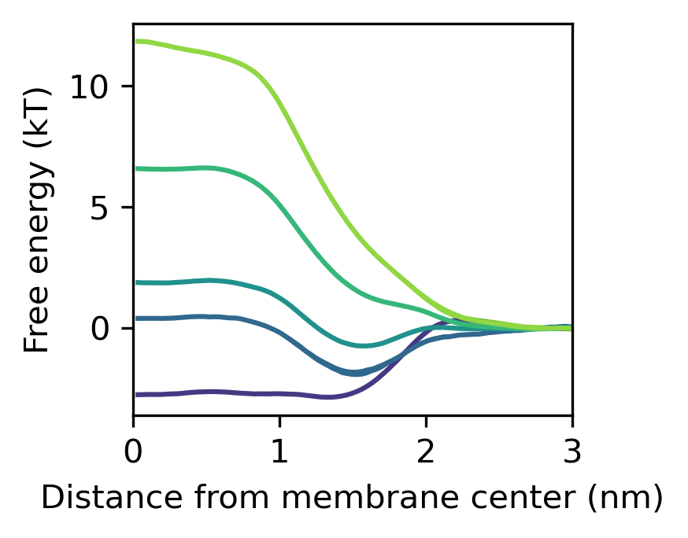
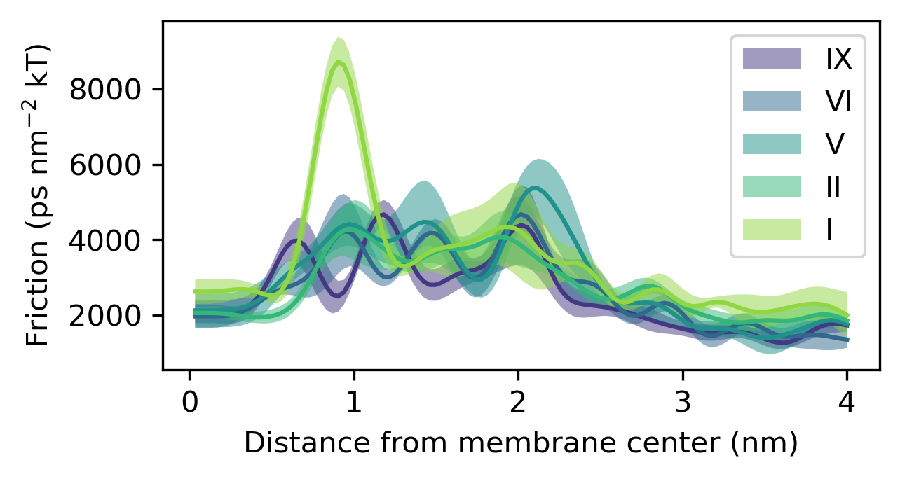

# DOPC simulations with Small particle

This folder contains simulations with DOPC and
various "Small-sized" particles. 
Various types of particles are used to simulate the 
Meyer-Overton rule.

THe simualtions are based on their counterparts from POPC and DPPC mixes in the folders one level above. 

## Analysis

The script 
`class_perme_simulation.py`
was used to calculate the permeability from the simulations. 
It is based on the basic notebook in `$PERME_DIR/martini3/some_name.ipynb`,
where the `class Simulation` was originally defined. 
The calculated permeabilities were manually copied to the file `permes_sims.txt`.
(how crude!)

In the notebook 
`plot_mean_solvation_of_x_all_sims.ipynb`
I evaluate 
the *mean solvation profiles* and 
the *degree of solvation profiles*
from the simulations.
They use the `pullx` file to get the membrane distance
and the `numcont...xvg` (calulated using `gmx mindist`)
to get the number of solvent particles in the vicinity (currently within 0.6 nm)
of the permeant. 

The following command was used to get the `numcont..` file:
`gmx mindist -od mindist_paricle-solvent -on numcont_particle-solvent -d 0.6 -f traj_comp.xtc -n ../../../index.ndx` 

# Results 

The main result is that the more hydrophilic the permeating particle is
the more it drags water inside the membrane tail region;

The free energy profiles simply follow the solubility,
and the friction profiles show that for highly hydrophilic particles (here *SP6*)
dewetting causes increased friction (compare the position with the degree of solvaiton above). 

The manually aggregated results from these permeability assays and POW values from Martini3 paper
are included in the [CSV file *sheet...csv*](sheet_pow_perm_var-particles.csv). 
